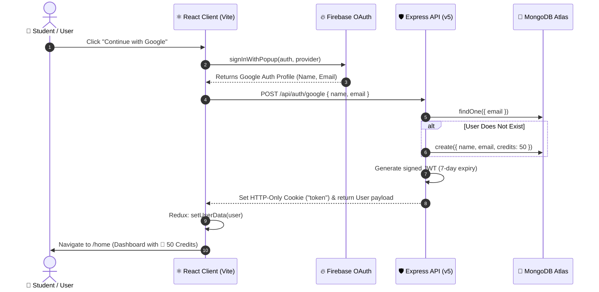
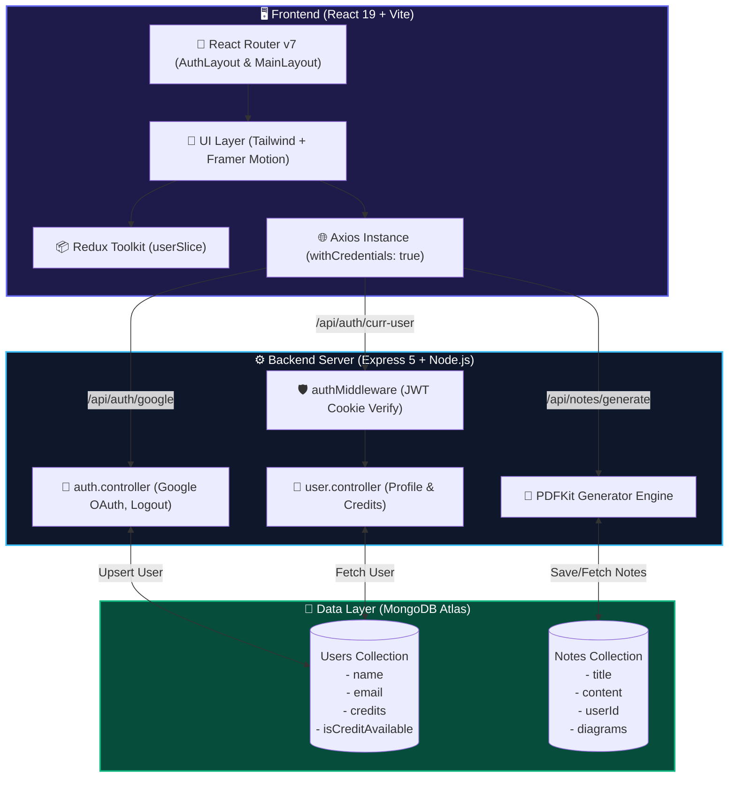

<div align="center">

  <!-- Animated Header Banner (Local Scalable SVG with Ambient Mesh Glow & Particle Effects) -->
  

  <br/>
  <br/>

  <!-- Dynamic Typing Subtitle -->
  <a href="https://git.io/typing-svg">
    
  </a>

  <br/>

  <!-- Badges Grid -->
  <p align="center">
    
    
    
    
    
    
    
    
  </p>

  <!-- Quick Action Buttons -->
  <p align="center">
    <a href="#-system-architecture--flow"><strong>Explore Architecture »</strong></a> •
    <a href="#-getting-started"><strong>Quick Start »</strong></a> •
    <a href="#-api-endpoints"><strong>API Docs »</strong></a> •
    <a href="#-core-features"><strong>Features »</strong></a>
  </p>

</div>

---

## 🚀 Overview

**ExamNotes AI** is a full-stack platform designed to help students and developers turn complex syllabus topics, assignments, and research materials into **high-yield, exam-oriented revision notes, visual diagrams, and downloadable PDFs** in seconds.

Powered by modern **React 19 + Framer Motion 3D cards** on the frontend and an **Express 5 + MongoDB + PDFKit** backend, equipped with secure token-based authentication and a built-in credit economy.

---

## ⚡ Key Highlights

<table>
  <tr>
    <td width="50%">
      <h3 align="center">🧠 AI-Driven Study Engine</h3>
      <ul>
        <li><b>High-Yield Summaries:</b> Condense 50-page topics into revision-ready bullet points.</li>
        <li><b>Exam Predictor:</b> Focus on frequently asked questions, key definitions, and theorems.</li>
        <li><b>Structured Documentation:</b> Formatted headers, code blocks, and formulas.</li>
      </ul>
    </td>
    <td width="50%">
      <h3 align="center">🎨 Visual & Interactive UI</h3>
      <ul>
        <li><b>3D Glassmorphism Cards:</b> Interactive tilt & physics animations with Framer Motion.</li>
        <li><b>Instant PDF Exporter:</b> Generate clean, print-ready PDFs with custom typography.</li>
        <li><b>Smart Credit System:</b> 50 free credits credited upon registration.</li>
      </ul>
    </td>
  </tr>
</table>

---

## 🔄 System Architecture & Flow

### 1. 🔐 User Authentication & Session Lifecycle



---

### 2. ⚡ Complete Application Architecture



---

## 📂 Project Structure

```bash
ExamNotesGenerator/
├── 📁 client/                     # Frontend Application
│   ├── 📁 public/                 # Static Assets & Icons
│   ├── 📁 src/
│   │   ├── 📁 api/                # Axios Configuration & Interceptors
│   │   │   └── axiosinstance.jsx  # Configured baseURL & withCredentials
│   │   ├── 📁 app/
│   │   │   └── 📁 layouts/        # Protected & Public Layout Guards
│   │   │       ├── AuthLayout.jsx # Redirects logged-in users to /home
│   │   │       └── MainLayout.jsx # Protects /home from unauthenticated users
│   │   ├── 📁 assets/             # Logos, SVGs, & Background Illustrations
│   │   ├── 📁 components/         # Reusable UI Components
│   │   │   ├── Feacture.jsx       # 3D Tilt Feature Display Cards
│   │   │   ├── MenuItem.jsx       # Profile Dropdown Actions
│   │   │   └── Navbar.jsx         # Glassmorphic Header & Credit Counter
│   │   ├── 📁 pages/              # Primary Route Views
│   │   │   ├── Auth.jsx           # Landing & Google OAuth Login
│   │   │   └── Home.jsx           # Note Generation Dashboard
│   │   ├── 📁 redux/              # Global State Management
│   │   │   ├── store.js           # Central Redux Store
│   │   │   └── userSlice.js       # User & Auth State Reducer
│   │   ├── 📁 routes/             # Client Routing Configuration
│   │   │   └── AppRoutes.jsx      # React Router DOM Tree
│   │   ├── 📁 services/           # API Service Helpers
│   │   │   └── api.js             # User & Session Fetchers
│   │   ├── 📁 utils/              # Third-party Integrations
│   │   │   └── firebase.js        # Firebase SDK Initializer & Providers
│   │   ├── App.jsx                # Root Application Shell
│   │   ├── main.jsx               # React DOM Entry Point
│   │   └── index.css              # Global Tailwind Styles
│   ├── package.json
│   └── vite.config.js
│
└── 📁 server/                     # Backend API Application
    ├── 📁 src/
    │   ├── 📁 app/
    │   │   └── app.js             # Express App Configuration & Middleware
    │   ├── 📁 config/             # Environment & Database Connectors
    │   │   ├── config.js          # Validated Env Config
    │   │   └── db.js              # Mongoose DB Connection Manager
    │   ├── 📁 controllers/        # Business Logic Controllers
    │   │   ├── auth.controller.js # Google Login & Cookie Invalidation
    │   │   └── user.controller.js # Current User & Balance Controllers
    │   ├── 📁 middleware/         # Custom Middleware
    │   │   └── auth.middleware.js # HTTP-Only JWT Cookie Authenticator
    │   ├── 📁 models/             # Mongoose Data Schemas
    │   │   └── user.model.js      # User Profile, Credits & Schema
    │   ├── 📁 routes/             # Express Endpoint Routers
    │   │   ├── auth.route.js      # Authentication Routes (/api/auth)
    │   │   └── suer.route.js      # User Routes (/api/auth/curr-user)
    │   ├── 📁 utils/              # Token & PDF Helpers
    │   │   └── token.js           # JWT Signer Utility
    │   └── server.js              # Server Initialization & Listener
    ├── package.json
    └── .env
```

---

## 🛠️ Tech Stack & Ecosystem

<div align="center">

| Area | Technologies |
| :--- | :--- |
| **Frontend Framework** | `React 19` • `Vite 6` • `JavaScript (ESM)` |
| **Styling & Animation** | `TailwindCSS` • `Framer Motion (motion/react)` • `React Icons` |
| **State Management & Routing** | `Redux Toolkit` • `React Router v7` |
| **Authentication Client** | `Firebase Authentication (Google Auth Provider)` |
| **Backend Framework** | `Node.js` • `Express.js v5` |
| **Database & ODM** | `MongoDB Atlas` • `Mongoose v9` |
| **Security & Tokens** | `JSON Web Tokens (JWT)` • `HTTP-Only Cookies` • `Cookie-Parser` • `CORS` |
| **Document Generation** | `PDFKit` (Vector PDF Renderer) |

</div>

---

## 📡 API Endpoints Specification

### Authentication & User Endpoints

| Method | Endpoint | Protection | Description |
| :--- | :--- | :--- | :--- |
| `POST` | `/api/auth/google` | 🌐 Public | Authenticates Google user & issues HTTP-Only JWT cookie |
| `GET` | `/api/auth/logout` | 🌐 Public | Clears the session cookie and invalidates client session |
| `GET` | `/api/auth/curr-user` | 🔒 Authenticated | Fetches profile, notes references, and available credits |

---

## 💻 Getting Started

### Prerequisites
- [Node.js](https://nodejs.org/) (v18.0.0 or higher recommended)
- [MongoDB](https://www.mongodb.com/atlas) account or local MongoDB instance
- [Firebase Console](https://console.firebase.google.com/) project with Google Auth enabled

---

### 1. Clone the Repository
```bash
git clone https://github.com/Mannsoni8/ExamNotesGenerator.git
cd ExamNotesGenerator
```

---

### 2. Configure Backend (`/server`)

1. Navigate to the server folder and install dependencies:
   ```bash
   cd server
   npm install
   ```

2. Create a `.env` file inside `/server`:
   ```env
   PORT=8000
   MONGODB_URI=your_mongodb_connection_string
   JWT_SECRET=your_super_secret_jwt_key
   CLIEN_URL=http://localhost:5173
   ```

3. Launch the server in development mode:
   ```bash
   npm run dev
   ```
   *The server will start on `http://localhost:8000`.*

---

### 3. Configure Frontend (`/client`)

1. Open a new terminal, navigate to the client folder, and install dependencies:
   ```bash
   cd client
   npm install
   ```

2. Create a `.env` file inside `/client`:
   ```env
   VITE_FIREBASE_APIKEY=your_firebase_api_key
   ```

3. Configure your Firebase settings in `client/src/utils/firebase.js` if necessary:
   ```javascript
   const firebaseConfig = {
     apiKey: import.meta.env.VITE_FIREBASE_APIKEY,
     authDomain: "your-project.firebaseapp.com",
     projectId: "your-project",
     storageBucket: "your-project.firebasestorage.app",
     messagingSenderId: "your-sender-id",
     appId: "your-app-id"
   };
   ```

4. Start the Vite dev server:
   ```bash
   npm run dev
   ```
   *The client will be running at `http://localhost:5173`.*

---

## 🎨 UI & Feature Showcase

```
+-------------------------------------------------------------------------------+
|  💎 ExamNotes AI                         [💎 50 Credits]  [👤 User Avatar]   |
+-------------------------------------------------------------------------------+
|                                                                               |
|   ✨ UNLOCK SMART AI NOTES                                                    |
|                                                                               |
|   Transform any exam syllabus or research paper into actionable revision     |
|   material with one click.                                                    |
|                                                                               |
|   +-----------------------+  +-----------------------+                        |
|   | 📝 Exam Notes         |  | 📊 Flowcharts & Visual|                        |
|   | High-yield summaries  |  | Auto-generated syntax |                        |
|   +-----------------------+  +-----------------------+                        |
|   +-----------------------+  +-----------------------+                        |
|   | 📁 Project Notes      |  | ⬇️ Free PDF Download  |                        |
|   | Assignment blueprints |  | Instant Vector Export |                        |
|   +-----------------------+  +-----------------------+                        |
|                                                                               |
+-------------------------------------------------------------------------------+
```

---

## 🗺️ Roadmap & Upcoming Features

- [x] Google OAuth Integration & Session Token Management
- [x] Framer Motion 3D Tilt Cards & Glassmorphic Navigation
- [x] Credit Economy (50 Free Welcome Credits)
- [ ] Multi-Modal Note Generation (Upload Syllabus PDFs & Images)
- [ ] Markdown & LaTeX Equation Renderer in Notes View
- [ ] Vector PDF Export with Custom Branding & Watermarks
- [ ] Flashcard & Quiz Generator based on Generated Notes

---

## 🤝 Contributing

Contributions make the open-source community an inspiring place to learn, inspire, and create. Any contributions you make are **greatly appreciated**!

1. Fork the Project
2. Create your Feature Branch (`git checkout -b feature/AmazingFeature`)
3. Commit your Changes (`git commit -m 'feat: add some AmazingFeature'`)
4. Push to the Branch (`git push origin feature/AmazingFeature`)
5. Open a Pull Request

---

<div align="center">

  

  <sub>Built with ❤️ by <a href="https://github.com/Mannsoni8">Mannsoni8</a> • Powered by AI & Modern Web Technologies</sub>

</div>
